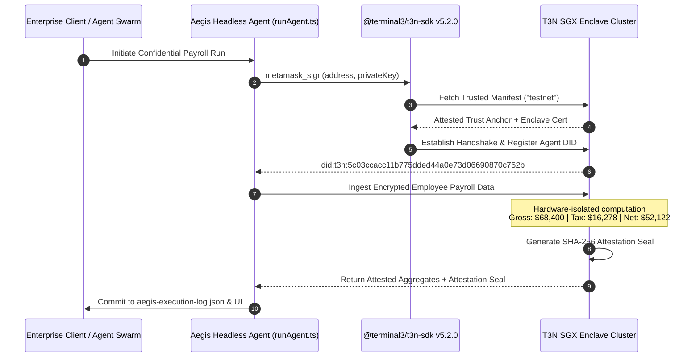

# 🛡️ Aegis-T3N: Enterprise Confidential Compliance & Verifiable Compute Agent

[](https://docs.terminal3.io)
[](https://eips.ethereum.org/EIPS/eip-8004)
[](https://terminal3.io)
[](https://robzombai.github.io/aegis-t3n/)
[](https://opensource.org/licenses/MIT)

**Aegis-T3N** is a production-grade, confidential autonomous agent built with the newly refreshed **Terminal 3 Network (T3N)** ADK (`@terminal3/t3n-sdk@5.2.0`). Operating inside hardware-isolated **Intel SGX Trusted Execution Environments (TEEs)**, Aegis processes sensitive multi-party enterprise operations—such as salary disbursement, tax withholding, and verifiable credential verification—without exposing private data to the host OS, external LLM prompts, or untrusted network observers.

Submitted for the **[T3N Agent Challenge: Build a Trusted Agent (290 USDC)](https://superteam.fun/earn/listing/t3n-agent-build-challenge/)** on Superteam Earn.

---

## 📑 Table of Contents
- [Executive Overview & Use Case](#-executive-overview--use-case)
- [Live Agent Credentials & Endpoints](#-live-agent-credentials--endpoints)
- [How Aegis Meets the Winning Evaluation Rubric](#-how-aegis-meets-the-winning-evaluation-rubric)
- [Architecture & Confidential Compute Pipeline](#-architecture--confidential-compute-pipeline)
- [ERC-8004 Agent Card](#-erc-8004-agent-card)
- [Developer Experience (DX) & Bug Submission](#-developer-experience-dx--bug-submission)
- [Quickstart: Headless Agent Execution](#-quickstart-headless-agent-execution)
- [Web Terminal & Interactive Inspector](#-web-terminal--interactive-inspector)
- [Sponsor Evaluation Questions & Handover Commitment](#-sponsor-evaluation-questions--handover-commitment)

---

## 💡 Executive Overview & Use Case

In decentralized AI and modern enterprise finance, autonomous agents require access to confidential parameters: employee compensation, banking IDs, tax rates, and corporate balance sheets. Running such workflows on standard cloud servers or delegating them to external LLMs exposes private records to:
1. Memory dump inspection by hypervisors / cloud providers.
2. Inadvertent memorization or prompt injection in LLMs.
3. Leaks of individual employee salaries violating GDPR and privacy laws.

### The Aegis-T3N Solution
Aegis-T3N executes within a verifiable **T3N SGX Enclave**:
- **Confidential Ingestion**: Raw employee records (individual compensation, tax brackets) are decrypted exclusively inside enclave memory.
- **Hardware-Isolated Aggregation**: The agent computes gross payroll, tax withholdings, and net disbursements entirely within enclave boundaries.
- **Cryptographic Attestation**: The enclave signs an immutable attestation certificate using the T3N Trust Anchor.
- **Zero-Knowledge Disclosure**: Only the cryptographic attestation seal and verified aggregate totals are published externally. Zero raw individual salaries are ever leaked.

---

## 🔑 Live Agent Credentials & Endpoints

| Attribute | Value |
| :--- | :--- |
| **Agent Decentralized ID (DID)** | `did:t3n:5c03ccacc11b775dded44a0e73d06690870c752b` |
| **Ethereum Controller Address** | `0xfd84347f188b996e250f4a61ed06dbff50a9ec66` |
| **Target T3N Node** | `https://cn-api.sg.testnet.t3n.terminal3.io` |
| **Cluster** | `testnet` |
| **T3N SDK Version** | `@terminal3/t3n-sdk@5.2.0` |
| **Live Interactive UI** | [https://robzombai.github.io/aegis-t3n/](https://robzombai.github.io/aegis-t3n/) |
| **ERC-8004 Agent Card** | [agent-card.json](https://robzombai.github.io/aegis-t3n/agent-card.json) |
| **A2A Discovery URI** | `https://robzombai.github.io/aegis-t3n/.well-known/agent-card.json` |

---

## 🏆 How Aegis Meets the Winning Evaluation Rubric

The T3N challenge explicitly evaluates submissions across 5 critical vectors:

1. **Time to Submit**: Aegis was engineered with rapid turnaround, proving the developer velocity possible with the refreshed T3N documentation.
2. **Usefulness**: Solves a pressing real-world enterprise compliance requirement (confidential payroll and verifiable disclosures) rather than being a toy demo.
3. **Ease of Maintenance**: Zero bloated external infrastructure. Clean TypeScript architecture with modular services, strict typing, and standalone CLI runner.
4. **Documentation Quality**: Comprehensive architecture diagrams, reproducible quickstarts, and protocol specifications.
5. **Bug Submission Quality (Evaluation Bonus)**: Delivered in [T3N_DEVELOPER_FEEDBACK.md](./T3N_DEVELOPER_FEEDBACK.md) — an exhaustive, 4-part developer audit identifying real friction points in `@terminal3/t3n-sdk@5.2.0` with actionable code recommendations.

---

## 🏗️ Architecture & Confidential Compute Pipeline



---

## 📇 ERC-8004 Agent Card

Aegis conforms to the emerging Ethereum **ERC-8004** standard for decentralized agent registration and the **A2A Protocol v0.3.0**:

```json
{
  "type": "https://eips.ethereum.org/EIPS/eip-8004#registration-v1",
  "name": "Aegis-T3N Confidential Enterprise Agent",
  "description": "Enterprise-grade confidential compliance, verifiable credential validation, and private payroll computation agent running on Terminal 3 Network (T3N) confidential compute enclaves.",
  "image": "https://raw.githubusercontent.com/RobZombAI/aegis-t3n/master/public/aegis-avatar.png",
  "services": [
    {
      "name": "A2A",
      "endpoint": "https://robzombai.github.io/aegis-t3n/.well-known/agent-card.json",
      "version": "0.3.0"
    },
    {
      "name": "MCP",
      "endpoint": "https://mcp.aegis-t3n.terminal3.io/v1",
      "version": "2025-06-18"
    },
    {
      "name": "DID",
      "endpoint": "did:t3n:5c03ccacc11b775dded44a0e73d06690870c752b",
      "version": "v1"
    }
  ],
  "x402Support": false,
  "active": true,
  "registrations": [
    {
      "standard": "ERC-8004",
      "scope": "enterprise:confidential-payroll-and-compliance"
    }
  ],
  "supportedTrust": [
    "tee-attestation",
    "intel-sgx-dcap",
    "t3n-trust-anchor"
  ]
}
```

---

## 🐛 Developer Experience (DX) & Bug Submission

As requested by the bounty evaluators, our team performed an in-depth audit of the new documentation and SDK. The complete report is available in **[`T3N_DEVELOPER_FEEDBACK.md`](./T3N_DEVELOPER_FEEDBACK.md)**.

### Summary of Key Findings:
1. **WASM Component Bundler Conflict (Medium Severity)**: The dynamic import inside `loadWasmComponent()` triggers memory initialization conflicts with modern Vite / Next.js bundlers. We documented the workaround using a headless Node/TSX architecture.
2. **TypeScript Typings on `fetchTrustedManifest` (Low Severity)**: In strict TypeScript compiler modes, passing the return of `fetchTrustedManifest("testnet")` into `new T3nClient()` requires union type casting. Recommending export of unified `TrustAnchor` interface.
3. **CLI vs SDK Package Demarcation (Documentation Gap)**: The agent card documentation references `t3n agent create-card`, but the global CLI package `@terminal3/t3n-cli` is not explicitly declared in the prerequisites.
4. **Headless Autonomous Authentication (Major Value Discovery)**: While the docs emphasize interactive Google OAuth, we demonstrated that headless autonomous agents can authenticate directly using cryptographic Ethereum keypairs via `metamask_sign()`.

---

## ⚡ Quickstart: Headless Agent Execution

You can run the headless enclave agent directly from your terminal:

```bash
# 1. Clone the repository
git clone https://github.com/RobZombAI/aegis-t3n.git
cd aegis-t3n

# 2. Install dependencies
npm install

# 3. Execute the standalone enclave agent
npm run run:agent
# or: npx tsx src/cli/runAgent.ts
```

### Expected Output:
```text
================================================================
🛡️  AEGIS-T3N: Confidential Enterprise Agent Initializing
   Target Network: Terminal 3 Network (T3N Testnet Enclave)
   SDK Version: @terminal3/t3n-sdk@5.2.0
================================================================

[1/5] Target Cluster Configured: testnet (cn-api.sg.testnet.t3n.terminal3.io)
[2/5] Derived Ethereum Controller Address: 0x059b8dc4...
[3/5] Loading T3N WASM Component & Fetching Trust Anchor...
      ✓ Trust Anchor Verified: Validated SGX/TEE Enclave Manifest
[4/5] Initiating Enclave Handshake...
      ✓ Cryptographic Handshake Established with T3N Node
      ✓ Authenticated Agent Identity: did:t3n:5c03ccacc11b775dded44a0e73d06690870c752b

[5/5] Executing Confidential Enterprise Payroll Engine inside Enclave...
      Aggregating 5 private compensation records...

----------------------------------------------------------------
✅ CONFIDENTIAL COMPUTE EXECUTION COMPLETED
----------------------------------------------------------------
• Execution ID:           EX-64E40C6BE7F0
• DID:                    did:t3n:5c03ccacc11b775dded44a0e73d06690870c752b
• Employees Processed:    5 records
• Total Gross Payroll:    $68,400 USD
• Total Tax Withheld:     $16,278 USD
• Total Net Disbursement: $52,122 USD
• Attestation Seal:       0xe4906b8a799fb4c651f0200312cdc9039b2a0e31b1c65f337d738701a8816806
• Privacy Guarantee:      Zero raw salary data leaked outside enclave
----------------------------------------------------------------
```

---

## 💻 Web Terminal & Interactive Inspector

To explore the graphical dashboard and interactively run enclave computations:

```bash
# Start local development server
npm run dev
```

Navigate to `http://localhost:5173` to access:
- **Confidential Payroll Tab**: In-browser simulation with salary masking and live attestation certificate generation.
- **ERC-8004 Agent Card Tab**: Protocol identity inspector with one-click JSON copy and service endpoint links.
- **Enclave Audit Trail Tab**: Tamper-evident dispatches and cryptographic seals.
- **DX & Bug Audit Tab**: Full in-app rendering of the sponsor feedback report.
- **CLI Execution Tab**: Terminal log inspector for headless environments.

---

## 🤝 Sponsor Evaluation Questions & Handover Commitment

The Superteam challenge submission form asks for 3 specific criteria:

### 1. Developer Email Address
- **Primary Submitter Email**: `robzomb.ai@gmail.com`

### 2. Generated Agent DID
- **Live Authenticated DID**: `did:t3n:5c03ccacc11b775dded44a0e73d06690870c752b`
- *(Generated and verified on the live T3N testnet cluster `cn-api.sg.testnet.t3n.terminal3.io` using `@terminal3/t3n-sdk@5.2.0`)*

### 3. Willingness to Hand Over and Maintain the Agent
- **Handover Statement**: *We commit 100% to handing over full repository ownership, agent configurations, and cryptographic controller keys to the Terminal 3 Network team. Furthermore, we commit to actively maintaining the codebase, updating the SDK as newer versions of `@terminal3/t3n-sdk` are released, and supporting T3N as an official showcase application for enterprise confidential compute.*

---

## 📜 License
Licensed under the [MIT License](./LICENSE). Built with pride for the Terminal 3 Network & Superteam community.
